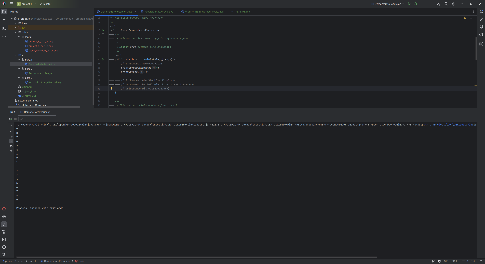
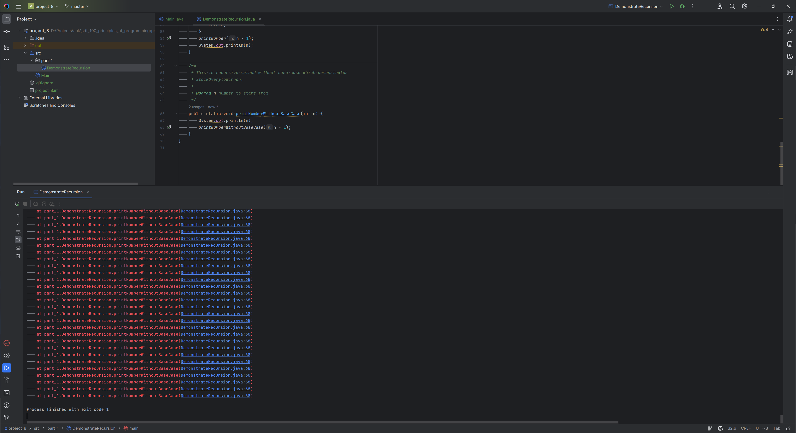
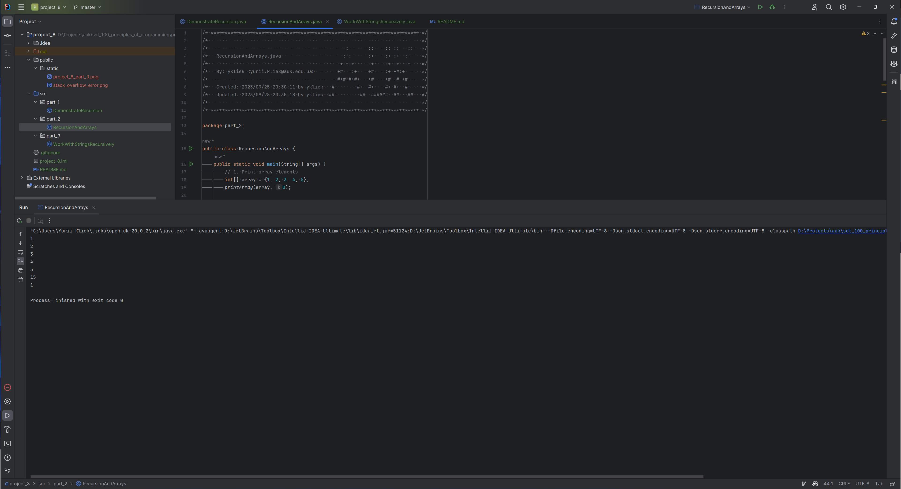
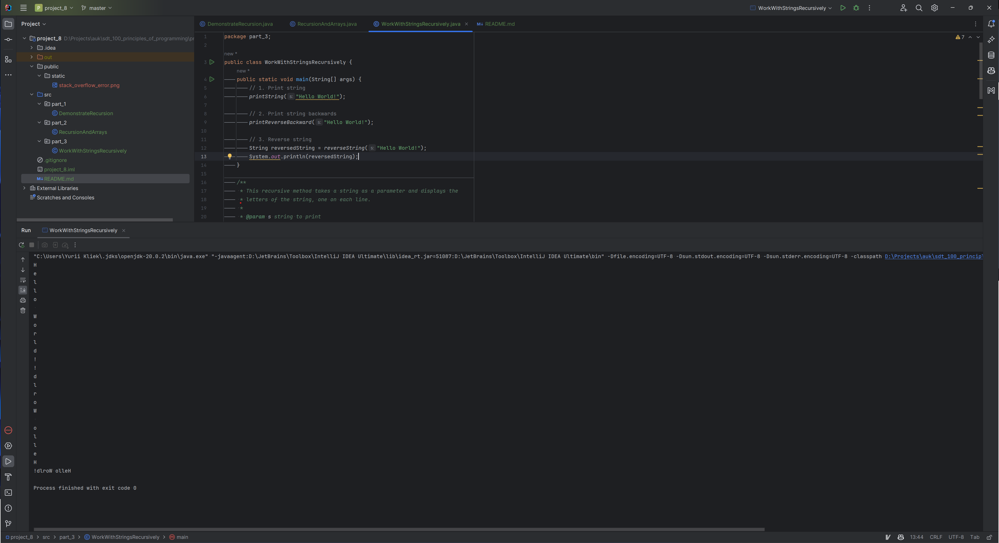

# UK SDT 100: Principles of Programming FA23: Project 8. Recursion

A series of Java projects demonstrating various programming techniques and best practices.

## Table of Contents

- [File Structure](#file-structure)
- [Part 1: Syntax](#part-1-demonstrate-recursion)
- [Part 2: Improved Rock Recommender II](#part-2-improved-rock-recommender-ii)
- [Part 3: Calculator](#part-3-calculator)

## File Structure

<pre>
project_8
│
├── public
│   └── static
│       └── [screenshots]
│
├── src
│   ├── part_1
│   │   └── DemonstrateRecursion.java
│   │
│   ├── part_2
│   │   └── RecursionAndArrays.java
│   │
│   └── part_3
│       └── WorkWithStringsRecursively.java
│
├── .gitignore
├── README.md
└── project_8.iml
</pre>


## Part 1: Demonstrate recursion

Create recursive function, which accept integer argument n and perform such output 9 8 7 6 5 4 3 2 1 when n=9.
<pre>
... void printNumberBackward(int n)
</pre>
Create recursive function, which accept integer argument n and perform such output 1 2 3 4 5 6 7 8 9 when n=9.
<pre>
... void printNumber(int n)
</pre>


Create recursive method without base case and demonstrate StackOverflowError (add a screenshot or the console).



## Part 2: Recursion and arrays

Create recursive function for printing array elements.
<pre>
   printArray(int[] array, int i)
</pre>
Create recursive function to calculate a sum of array elements.
<pre>
int arraySum(int[] array, int i)
</pre>
Create recursive function to find how many elements of an array are equal to a given value. Pass the given value as an argument.
<pre>
int findCountInArray(int[] array, int what, int i)
</pre>


## Part 3: Work with strings recursively

Print String. Write a method that takes a string as a parameter and displays the letters of the string, one on each line. It should be a void method. Use ```str.substring(1)``` to pass the rest of the string into recursive call. Do not use any additional index parameters in a recursive method. Use ```str.charAt(0)``` to get first character.
<pre>
void printString(String s)
</pre>
Print reverse string. Write a method that takes a string as a parameter and displays the letters of the string backward, one on each line. It should be a void method. Use ```str.substring(1)``` to pass the rest of the string into recursive call. Do not use any additional index parameters in a recursive method.
<pre>
void printReverseString(String s)
</pre>
Reverse String. Write a recursive method that takes a string as a parameter and returns a new string as a return value. The new string should contain the same letters as the parameter, but in reverse order. Use ```str.substring(1)``` to pass the rest of the string into recursive call. Do not use any additional index parameters in a recursive method.
<pre>
String reverseString(String s)
</pre>

